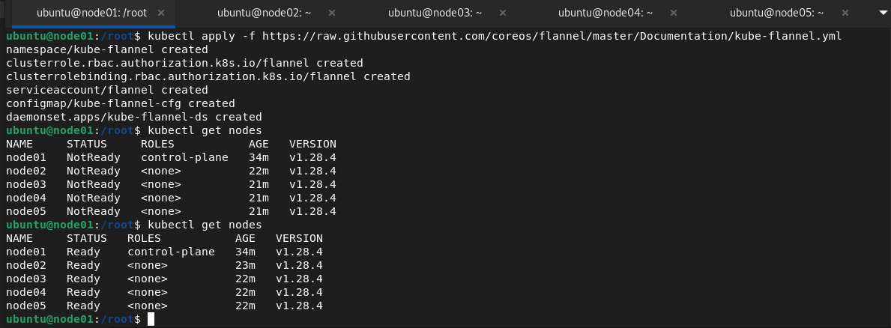

# Домашнее задание к занятию «Установка Kubernetes»

### Цель задания

Установить кластер K8s.

### Чеклист готовности к домашнему заданию

1. Развёрнутые ВМ с ОС Ubuntu 20.04-lts.


### Инструменты и дополнительные материалы, которые пригодятся для выполнения задания

1. [Инструкция по установке kubeadm](https://kubernetes.io/docs/setup/production-environment/tools/kubeadm/create-cluster-kubeadm/).
2. [Документация kubespray](https://kubespray.io/).

-----

### Задание 1. Установить кластер k8s с 1 master node

1. Подготовка работы кластера из 5 нод: 1 мастер и 4 рабочие ноды.
2. В качестве CRI — containerd.
3. Запуск etcd производить на мастере.
4. Способ установки выбрать самостоятельно.
## Решение
Создаем 5 виртуальных машин в Yandex Cloud  с помощью terraform


на каждой из машин выполняем команды для установки необходимых пакетов:
```
sudo apt-get update   
sudo apt-get install apt-transport-https ca-certificates   
mkdir /etc/apt/keyrings/   
curl -fsSL https://pkgs.k8s.io/core:/stable:/v1.28/deb/Release.key | sudo gpg --dearmor -o /etc/apt/keyrings/kubernetes-apt-keyring.gpg
echo 'deb [signed-by=/etc/apt/keyrings/kubernetes-apt-keyring.gpg] https://pkgs.k8s.io/core:/stable:/v1.28/deb/ /' | sudo tee /etc/apt/sources.list.d/kubernetes.list
sudo apt-get update 
sudo apt install kubelet kubeadm kubectl containerd
sudo apt-mark hold kubelet kubeadm kubectl
```


На всех машинах необходимо включить форвардинг

Далее инициализируем кластер на мастер-ноде
```kubeadm init \   
--apiserver-advertise-address=192.168.10.7 \     внутренний адрес мастер-ноды   
--pod-network-cidr 10.244.0.0/16 \   сеть для подов   
--apiserver-cert-extra-sans=158.160.119.193    внешний адрес мастер-ноды
```


Подключаем каждую worker-node с помощью команды kubectl join, которую выдал мастер после инициализации:


На мастере настраиваем kubeconfig
```
mkdir $HOME/.kube
sudo cp -i /etc/kubernetes/admin.conf $HOME/.kube/config
sudo chown $(id -u):$(id -g) $HOME/.kube/config
```
Проверяем ноды


Необходимо установить сетевой плагин
После установки flannel ноды в кластере работают!


## Дополнительные задания (со звёздочкой)

**Настоятельно рекомендуем выполнять все задания под звёздочкой.** Их выполнение поможет глубже разобраться в материале.   
Задания под звёздочкой необязательные к выполнению и не повлияют на получение зачёта по этому домашнему заданию. 

------
### Задание 2*. Установить HA кластер

1. Установить кластер в режиме HA.
2. Использовать нечётное количество Master-node.
3. Для cluster ip использовать keepalived или другой способ.

### Правила приёма работы

1. Домашняя работа оформляется в своем Git-репозитории в файле README.md. Выполненное домашнее задание пришлите ссылкой на .md-файл в вашем репозитории.
2. Файл README.md должен содержать скриншоты вывода необходимых команд `kubectl get nodes`, а также скриншоты результатов.
3. Репозиторий должен содержать тексты манифестов или ссылки на них в файле README.md.
