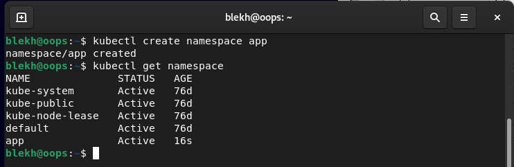
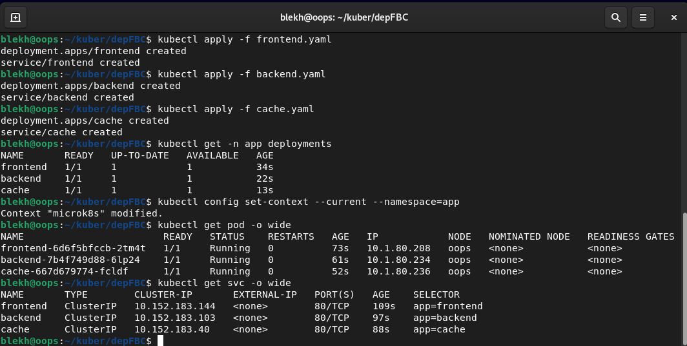
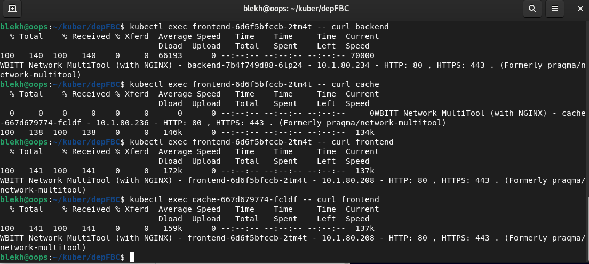
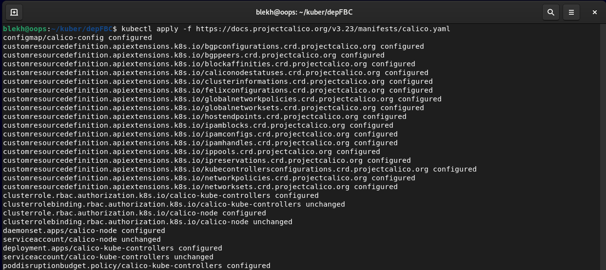
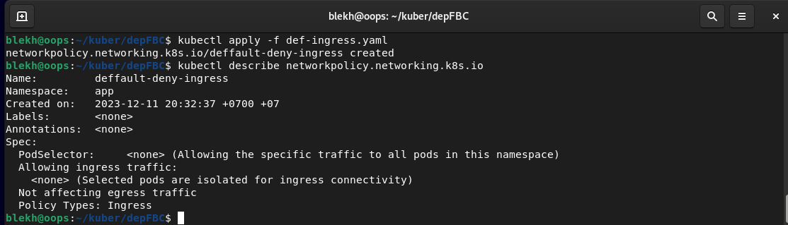
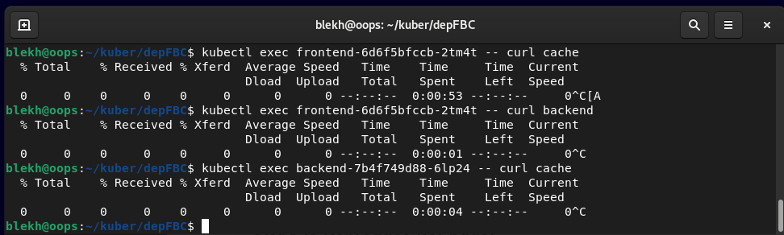

# Домашнее задание к занятию «Как работает сеть в K8s»

### Цель задания

Настроить сетевую политику доступа к подам.

### Чеклист готовности к домашнему заданию

1. Кластер K8s с установленным сетевым плагином Calico.

### Инструменты и дополнительные материалы, которые пригодятся для выполнения задания

1. [Документация Calico](https://www.tigera.io/project-calico/).
2. [Network Policy](https://kubernetes.io/docs/concepts/services-networking/network-policies/).
3. [About Network Policy](https://docs.projectcalico.org/about/about-network-policy).

-----

### Задание 1. Создать сетевую политику или несколько политик для обеспечения доступа

1. Создать deployment'ы приложений frontend, backend и cache и соответсвующие сервисы.
2. В качестве образа использовать network-multitool.
3. Разместить поды в namespace App.
4. Создать политики, чтобы обеспечить доступ frontend -> backend -> cache. Другие виды подключений должны быть запрещены.
5. Продемонстрировать, что трафик разрешён и запрещён.

## Решение
Создаем namespace app   
   

Создаем Deployments и Services:
   - [frontend](files/frontend.yaml)
   - [backend](files/backend.yaml)
   - [cache](files/cache.yaml)
     
   

Проверяем, что поды подключаются друг к другу:   
 

Устанавливаем Calico:

Применяем политику, которая запрещает все входящие подключения:
- [default-deny-ingress](files/def-ingress.yaml)
  

Проверяем, подключение между подами отсутствует:

Применяем политики, которые разрешают входящие подключения frontend -> backend -> cache:
- [backend-ingress](files/backend-ingress.yaml)
- [cache-ingress](files/cache-ingress.yaml)

Проверяем трафик:

### Правила приёма работы

1. Домашняя работа оформляется в своём Git-репозитории в файле README.md. Выполненное домашнее задание пришлите ссылкой на .md-файл в вашем репозитории.
2. Файл README.md должен содержать скриншоты вывода необходимых команд, а также скриншоты результатов.
3. Репозиторий должен содержать тексты манифестов или ссылки на них в файле README.md.
