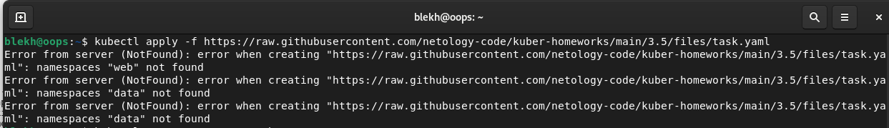
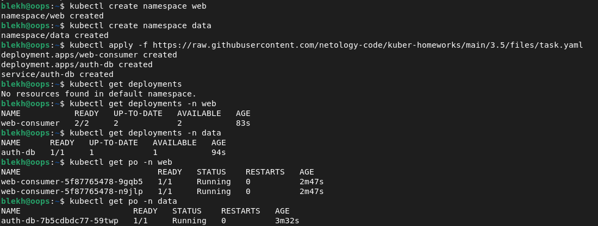
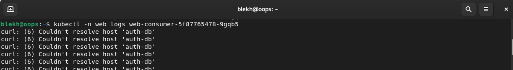
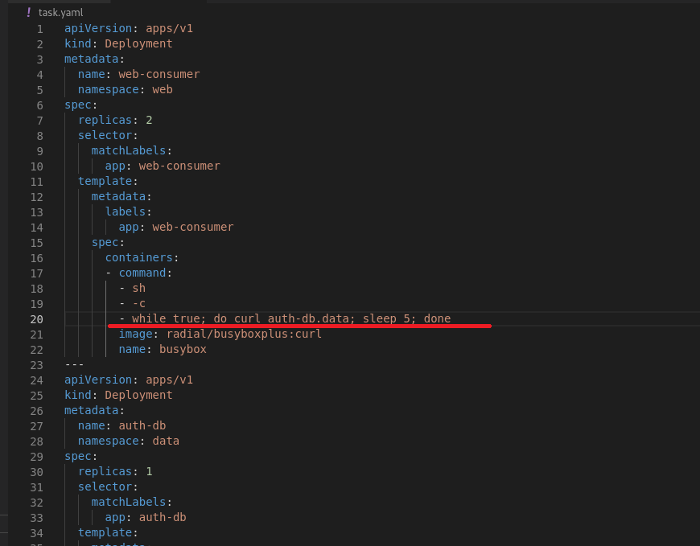
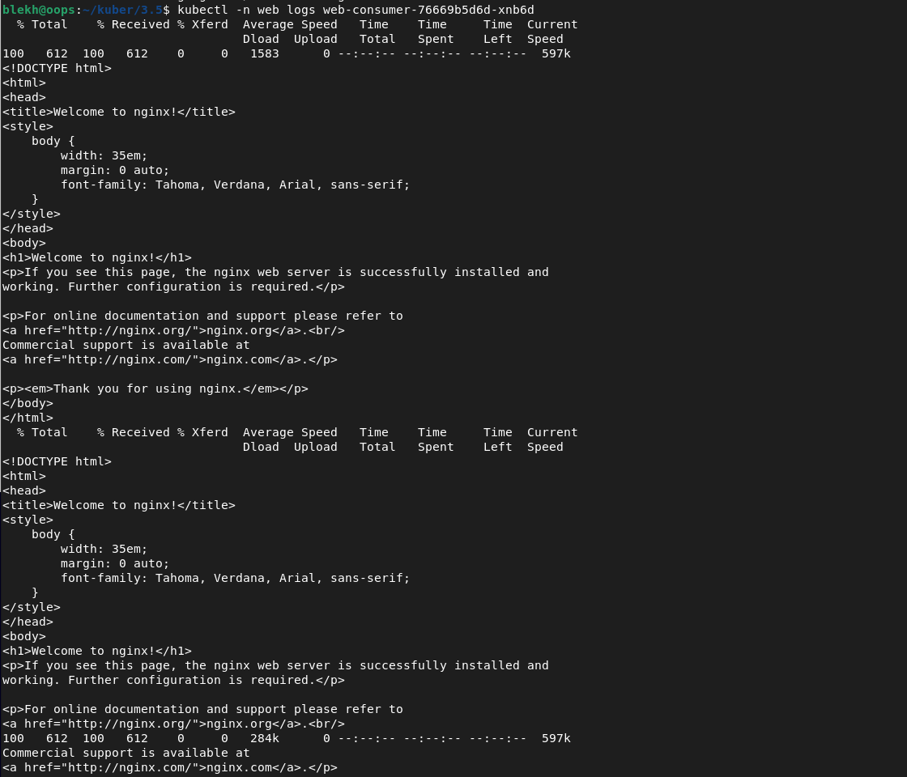

# Домашнее задание к занятию Troubleshooting

### Цель задания

Устранить неисправности при деплое приложения.

### Чеклист готовности к домашнему заданию

1. Кластер K8s.

### Задание. При деплое приложение web-consumer не может подключиться к auth-db. Необходимо это исправить

1. Установить приложение по команде:
```shell
kubectl apply -f https://raw.githubusercontent.com/netology-code/kuber-homeworks/main/3.5/files/task.yaml
```
2. Выявить проблему и описать.
3. Исправить проблему, описать, что сделано.
4. Продемонстрировать, что проблема решена.

#### Решение    
1. При установке приложения возникает ошибка:

  Причина ошибки - нет namespace web и data. Создаем, ошибка уходит. В namespace web запущено приложение
   web-consumer, в namespace data приложение и сервис auth-db   


2.  При деплое приложение web-consumer не может подключиться к auth-db - смотрим лог пода с web-consumer
   
Видим, что приложение не может подключиться к сервису по имени. Каждому сервису, созданному с помощью объекта Service, присваивается доменное имя (DNS), совпадающее с именем самого сервиса.
Дело в том, что приложение  web-consumer создано пространстве имен web, а сервис - в data  и просто по имени обратиться нельзя, нужно указать namespace.   

3.  В конфигурации деплоймента web-consumer явно указываем что приложение будет обращаться к сервису auth-db из namespase data:   
   

4. Приложение успешно подключается:
 

### Правила приёма работы

1. Домашняя работа оформляется в своём Git-репозитории в файле README.md. Выполненное домашнее задание пришлите ссылкой на .md-файл в вашем репозитории.
2. Файл README.md должен содержать скриншоты вывода необходимых команд, а также скриншоты результатов.
3. Репозиторий должен содержать тексты манифестов или ссылки на них в файле README.md.
